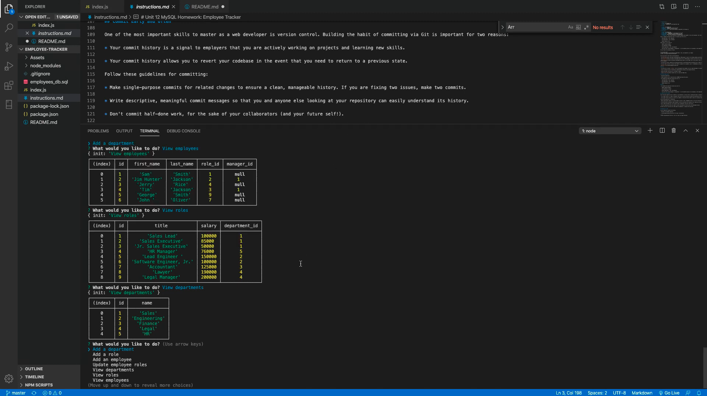

## Github URL 
https://github.com/mlshenk/employee-tracker

## YouTube video URL
https://youtu.be/c-pWstROeEI

## Description
This was a challenging, thorough assignment that required extensive use of command line functions to enter inputs into MySQL databases. The user can use the command line functions to create three different tables in the database to retrieve information about the company's departments, roles, and individual employees. The tables were connected and could interact with each other to pull data from other tables. For example, the table with employee data required data from the table with role information. The code utilized foreign keys in order to link data from the different databases to each other and allow the user to access them. Ultimately, the user should complete the employee, role, or department data into the table and be able to 1.) add to the tables, and 2.) view the information that has already been entered. The user may also edit/update the tables, such as the role table, if a specific detail were to be changed. The prompts continue to cycle after each piece of data is entered, viewed, or updated. The user may also scroll to the Exit option, which disconnects the user from the database. The user would then need to run the "node index.js" (my file name) command again to make additional edits or view the data.

## Screenshot

Below is a screenshot of the app's functionality.
